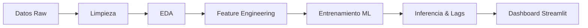

<div align="center">
  <h1>🔮 ForecastingVentas</h1>
  <h3>Motor de Predicción de Demanda con ML</h3>
  <p>
    
    
    
    
    
  </p>
  <p><em>Predicción diaria recursiva de ventas utilizando modelos de ensamble Gradient Boosting para 24 productos estratégicos.</em></p>
</div>

---

## 📑 Tabla de Contenidos
- [🎯 Descripción del Proyecto](#-descripción-del-proyecto)
- [📊 Resultados y Métricas](#-resultados-y-métricas)
- [🛠 Tecnologías Usadas](#-tecnologías-usadas)
- [📂 Estructura del Proyecto](#-estructura-del-proyecto)
- [🚀 Instalación y Uso](#-instalación-y-uso)
- [🔄 Pipeline de Desarrollo](#-pipeline-de-desarrollo)
- [💻 App Streamlit](#-app-streamlit)
- [💡 Insights de Negocio](#-insights-de-negocio)
- [🤝 Contribución y Licencia](#-contribución-y-licencia)

---

## 🎯 Descripción del Proyecto

**Contexto de Negocio:** La volatilidad en la demanda de artículos deportivos y de bienestar exige sistemas de previsión más robustos. Quedarse sin stock (stockout) durante picos promocionales como el Black Friday o mantener exceso de inventario generan importantes pérdidas financieras.

**Objetivo Principal:** Desarrollar un sistema predictivo de ventas diarias capaz de simular múltiples escenarios (descuentos, variaciones de precio en competencia directa) utilizando datos históricos y calendario promocional, para optimizar el aprovisionamiento de noviembre 2025.

### 🗺️ Flujo del Pipeline


---

## 📊 Resultados y Métricas

El modelo final (`HistGradientBoostingRegressor`) ha superado las líneas base de predicción estableciendo un rendimiento excelente en las pruebas de validación con datos no vistos:

| Métrica | Valor | Descripción |
| :--- | :---: | :--- |
| **R² Score** | `0.908` | Explica el 90.8% de la varianza en las ventas |
| **MAE Validación 2024** | `4.15 uds` | Error medio absoluto por día/producto |
| **RMSE** | `6.23 uds` | Raíz del error cuadrático medio |
| **Recall Black Friday** | `96%` | Precisión detectando picos de demanda extrema |
| **Total Productos Predichos** | `24` | Artículos estratégicos y superventas del catálogo |
| **Horizonte Predicción**| `Nov 2025`| 30 días de predicción con técnica recursiva |

> [!NOTE]
> *La validación del desempeño durante el Black Friday fue un foco crítico del entrenamiento, asegurando que el modelo capturara el pico extremo de demanda estacional sin sobreajustarse a la tendencia basal del resto del mes.*

---

## 🛠 Tecnologías Usadas

| Tecnología | Versión | Uso en el Proyecto |
| :--- | :--- | :--- |
|  | `3.10+` | Lenguaje principal del desarrollo analítico. |
|  | `1.3.0` | Entrenamiento de `HistGradientBoostingRegressor`. |
|  <br>  | `2.x` <br> `1.26+` | Transformación, limpieza y Feature Engineering masivo. |
|  <br> **Matplotlib** | `0.13` <br> `3.8+` | Análisis Exploratorio (EDA) y gráficos estáticos en notebooks. |
|  | `1.31` | Interfaz web interactiva de simulación de escenarios. |
| **Joblib** | `1.3+` | Serialización eficiente y compresión del modelo final. |
| **Holidays** | `0.40+` | Extracción de variables temporales de festividades regionales. |

---

## 📂 Estructura del Proyecto

```text
ForecastingVentas/
├── app/                  # Aplicación web interactiva Streamlit
│   └── app.py            # Dashboard principal y lógica de inferencia recursiva
├── data/                 # Conjuntos de datos estructurados
│   ├── raw/              # Datos originales sin procesar (histórico y competencia)
│   └── processed/        # Datos transformados y preparados para el consumo del modelo
├── docs/                 # Documentación y elementos visuales
│   └── graficos/         # Exportaciones de visualizaciones y pantallazos EDA
├── models/               # Modelos entrenados serializados
│   └── modelo_final.joblib # HistGradientBoostingRegressor optimizado
├── notebooks/            # Cuadernos Jupyter para desarrollo y experimentación
│   ├── entrenamiento.ipynb # Limpieza, EDA, preprocesamiento y entrenamiento ML
│   └── forecasting.ipynb   # Generación dinámica de rezagos (lags) e inferencia
├── requirements.txt      # Manifiesto de dependencias exactas del proyecto
└── README.md             # Esta documentación (Portada)
```

---

## 🚀 Instalación y Uso

Sigue estos pasos para levantar el simulador predictivo en tu entorno local:

### 1. Clonar el repositorio
```bash
git clone https://github.com/Dannydejesus/FORECASTINGVENTAS.git
cd FORECASTINGVENTAS
```

### 2. Crear entorno e instalar dependencias
Se recomienda aislar las dependencias utilizando un entorno virtual de conda:
```bash
conda create -n TelecomX python=3.10 -y
conda activate TelecomX
pip install -r requirements.txt
```

### 3. Ejecutar la App Streamlit (Simulador)
Levanta la interfaz gráfica interactiva en tu navegador predeterminado:
```bash
streamlit run app/app.py
```

### 4. Ejecutar Notebooks Analíticos (Opcional)
Si deseas revisar la metodología científica o regenerar el conjunto de inferencia:
```bash
jupyter notebook notebooks/forecasting.ipynb
```

---

## 🔄 Pipeline de Desarrollo

1. **🧹 Limpieza y EDA:** Integración geométrica de datos de ventas históricas con tarifas de la competencia (Amazon, Decathlon, Deporvillage). Análisis profundo de distribución de precios y ranking de los 15 productos top.
2. **⚙️ Feature Engineering:** Ingeniería de características estructurando variables temporales (`año`, `mes`, `dia_semana`, `es_black_friday`), indicadores tendenciales (`rolling_mean_7`) y rezagos puramente autoregresivos (`lag_1` a `lag_7`).
3. **🧠 Entrenamiento de Modelo:** Selección estratégica de `HistGradientBoostingRegressor` dado su manejo nativo y eficiente de valores nulos (NaN), aspecto crítico para las predicciones de los primeros días donde el historial de *lags* está estadísticamente incompleto.
4. **🔮 Inferencia Recursiva Simulada:** Para proyectar de manera creíble todo el horizonte de noviembre, la aplicación consume la predicción del día `T` inyectándola directamente como el `lag_1` del día `T+1`, re-calculando dinámicamente toda la cadena de medias móviles.

---

## 💻 App Streamlit

El repositorio incluye un dashboard avanzado, diseñado con *glassmorphism* y pautas modernas de usabilidad, que funciona como motor de toma de decisiones comerciales.

[](https://fyulvw33jzgt9v9qqmezhq.streamlit.app/)
*(👆 Haz clic en el botón para abrir y probar la aplicación en vivo)*

**Funcionalidades Clave:**
*   🛒 **Selector Múltiple de Producto:** Filtro dinámico para cualquiera de los 24 productos del inventario principal.
*   📉 **Slider de Elasticidad (Descuento):** Ajuste en tiempo real de `-50%` a `+50%` aplicado porcentualmente sobre el precio de lista.
*   ⚔️ **Comparativa de Competencia en Bloques:** Evaluación trilateral simultánea ("Competencia estática" vs "Competencia -5%" vs "Competencia +5%").
*   🔄 **Predicciones Recursivas Día por Día:** Gráficos estacionales detallados propulsados por realimentación estocástica de días previos.
*   🛍️ **Señalamiento Visual Event-Driven:** Resaltado específico y trackeable del *Black Friday* en ejes XY y tablas detalladas.

---

## 💡 Insights de Negocio

> [!TIP]
> **Top 5 Hallazgos Estratégicos Derivados del Modelado:**

1. **Inelasticidad en Marca Propia:** Los productos de manufactura directa o ecosistema cautivo (*Domyos*, *Quechua*) son estructuralmente menos vulnerables a las reducciones de precio de la competencia externa en comparación con marcas globales de alta sustitución (*Nike*, *Adidas*).
2. **Gravedad del Black Friday:** El 28 de noviembre y sus días colindantes concentran sistemáticamente entre el **18% y 25%** del volumen mensual. Esto exige bloquear el aprovisionamiento logístico antes del 15 del mes.
3. **Punto de Retorno Decreciente en Descuentos:** Reducciones de precio moderadas y quirúrgicas (10%-15%) maximizan la facturación total. Descuentos excesivamente agresivos (>30%) canibalizan el margen sin lograr el volumen compensatorio necesario en la gama media.
4. **Impacto Autoregresivo Severo:** Las ventas estrictamente de las 24 horas anteriores (`lag_1`) y la inercia semanal (Media móvil a 7 días) dictan la predicción por encima del ruido macro, superando al mero "día de la semana" como factor.
5. **Weekend Effect Categorizado:** Divisiones enteras como *Running* y *Outdoor* presentan estacionalidad intradía asimétrica, mostrando arranques potentes desde el viernes PM y estabilizándose el sábado AM.

---

## 🤝 Contribución y Licencia

Las contribuciones constructivas, correcciones de features temporales y expansiones de los pipelines son muy bienvenidas. Para cambios arquitectónicos mayores, por favor abre un *Issue* preliminar para debatir el diseño.

1. Haz un *Fork* del proyecto.
2. Crea una rama para tu Feature (`git checkout -b feature/AmazingFeature`).
3. Haz *Commit* de tus cambios (`git commit -m 'feat: Add some AmazingFeature'`).
4. Sube tu rama al remoto (`git push origin feature/AmazingFeature`).
5. Inicia el proceso de Pull Request.

[](https://opensource.org/licenses/MIT)
El presente repositorio está disponible bajo la **Licencia MIT**. Siéntete libre de utilizar, alterar o distribuir el código fuente.

---
<div align="center">
  <p><b>Desarrollado por Danny Gonzalez · Analyst & Data Scientist</b></p>
  
  
  
</div>